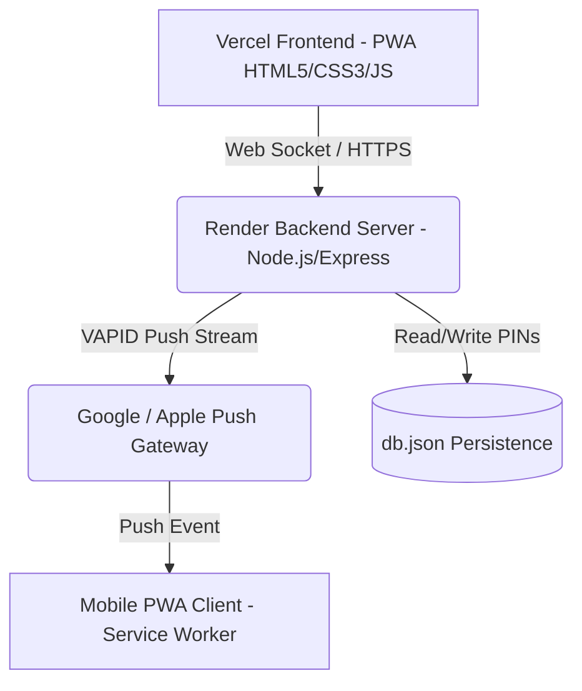

# ShadowLink System Documentation & Software Requirements Specification (SRS)

This document contains the comprehensive documentation and Software Requirements Specification (SRS) for **ShadowLink**, a secure, real-time, disappearing messaging Progressive Web App (PWA).

---

## 1. Introduction

### 1.1 Purpose
The purpose of this document is to specify the architectural layout, functional and non-functional requirements, data mapping, and deployment patterns for the ShadowLink chat application.

### 1.2 Scope
ShadowLink is a secure, private communication tool designed for team environments. It focuses on absolute privacy by hiding real names, enforcing 4-digit PIN authentication, automatically destroying messages 10 seconds after receipt, and delivering real-time notification alerts directly to mobile devices even when the application is closed.

### 1.3 Key System Constraints
- **Absolute Privacy**: Real names must not be visible on client screens.
- **Zero Traces**: Messages must self-destruct exactly 10 seconds after being read, wiping content from both RAM and local buffers.
- **Continuous Alerts**: Offline mobile devices must receive Web Push Notifications (Web Push Protocol / VAPID).

---

## 2. Predefined Users & Codename Mapping

The system operates strictly on a mapped list of 9 profiles. The mappings are stored securely on the backend server:

| ID | Secret Codename | Real Name | Avatar Style (CSS Gradient) |
|----|-----------------|-----------|-----------------------------|
| u1 | **Raven** | Deepak Nautiyal | `linear-gradient(135deg, #FF6B6B, #FF8E53)` |
| u2 | **Cipher** | Ayush Sharma | `linear-gradient(135deg, #F3A683, #F19066)` |
| u3 | **Falcon** | Vipul Tiwari | `linear-gradient(135deg, #4834D4, #686DE0)` |
| u4 | **Orion** | Chandra Prakash Maurya | `linear-gradient(135deg, #1DD1A1, #10AC84)` |
| u5 | **Shadow** | Navneet Tiwari | `linear-gradient(135deg, #FF9F43, #FFB142)` |
| u6 | **Viper** | Amit Chahar | `linear-gradient(135deg, #0984E3, #74B9FF)` |
| u7 | **Phoenix** | Tattvam Shiva Chaturvedi | `linear-gradient(135deg, #2C3E50, #34495E)` |
| u8 | **Ghost** | Prakhar Kumar Singh | `linear-gradient(135deg, #E84393, #FD79A8)` |
| u9 | **Wolf** | Manas Maurya | `linear-gradient(135deg, #6C5CE7, #A29BFE)` |

---

## 3. System Architecture



### 3.1 Frontend (PWA Client)
- **Tech Stack**: Vanilla HTML5, Vanilla CSS3, Javascript (ES6), Socket.io Client library, Web Audio API.
- **Progressive Web App**: Supported by `manifest.json` and `sw.js` (Service Worker) to allow 1-click home screen installation on iOS and Android.
- **Local Storage Sandbox**: Implements offline backup caching. Isolates stored histories by `currentUser.id` to prevent device snooping.

### 3.2 Backend (Server)
- **Tech Stack**: Node.js, Express, Socket.io Server, Web-Push library.
- **Real-Time Engine**: Socket.io handles direct client routing using socket maps.
- **Credentials Engine**: Validates PIN states and persists them to `db.json` database.

---

## 4. Software Requirements Specification (SRS)

### 4.1 Functional Requirements

#### 4.1.1 ID & PIN Authentication
- Users must log in by entering their secret codename (e.g., `Shadow`) and a 4-digit PIN.
- If a codename does not have a PIN set in `db.json`, the user is prompted to lock the profile with the entered PIN.
- Subsequent logins require verification of the correct PIN.
- Authentication states must persist via `localStorage` as `shadow_session` until the user manually triggers a Logout.

#### 4.1.2 Real-Time Messaging & Status indicators
- Users can choose online colleagues from a dynamic list.
- Sending text messages (up to 160 characters) instantly transmits them via Socket.io.
- Real-time online/offline status indicators (`online` / `offline`) are displayed dynamically.
- Custom sounds are synthesized via the Web Audio API for message events (Sent sound, Received pop, Self-destruct sweep).

#### 4.1.3 Self-Destruct Logic (Snaps)
- Incoming messages are marked as "Tap to View" buttons.
- Tapping triggers a 10-second countdown visually indicated by a ticking circle timer.
- After 10 seconds, the message changes status to "destroyed". The text content is permanently deleted from server RAM and local memory.

#### 4.1.4 Web Push Notifications (Web Push Protocol)
- Supports background alerts when the app is closed or the device screen is off.
- Utilizes permanent VAPID keys for secure subscription verification.
- **Mobile optimization**: Always sends pushes when messages arrive. The client service worker displays the notification only if the app is not actively focused in the foreground.
- Employs a heavy-priority vibration pattern (`[1000, 200, 1000, 200, 1000]`) and system default sound flags to wake up device screens.

### 4.2 Non-Functional Requirements

- **Security & Confidentiality**: Real names are kept on the server and never sent to other clients. Messages are wiped immediately after the timer expires.
- **Responsive Layout**: Adopts a fluid media-query system. Mobile screens use a sliding panel layout with a "Back to List" navigation button.
- **Scroll Optimization**: Uses `-webkit-overflow-scrolling: touch` for fluid 60FPS scroll physics on mobile devices. Background blur glows are configured with `pointer-events: none` to prevent scroll blocks.

---

## 5. File Configurations

### 5.1 Web App Manifest (`public/manifest.json`)
Allows browser installations to behave as fullscreen standalone apps:
```json
{
  "name": "ShadowLink Secret Messenger",
  "short_name": "ShadowLink",
  "start_url": "/index.html",
  "display": "standalone",
  "orientation": "portrait",
  "background_color": "#0a0e17",
  "theme_color": "#0a0e17",
  "icons": [
    { "src": "https://img.icons8.com/color/192/000000/ghost.png", "sizes": "192x192", "type": "image/png" },
    { "src": "https://img.icons8.com/color/512/000000/ghost.png", "sizes": "512x512", "type": "image/png" }
  ]
}
```

### 5.2 Service Worker (`public/sw.js`)
Configured to cache main assets and process push notification streams dynamically:
- Wakes up the mobile device background.
- Focuses active app tab on banner clicks.

---

## 6. Implementation and Deployment

### 6.1 Backend Host (Render)
1. Launch Node.js app pointing to `server.js`.
2. Connect to GitHub.
3. Configure start command: `node server.js`
4. Set CORS headers configuration dynamically to allow traffic from client origins.

### 6.2 Frontend Host (Vercel)
1. Reads `vercel.json` and routes requests to `/public/`.
2. Resolves API endpoints dynamically targeting the Render server.
